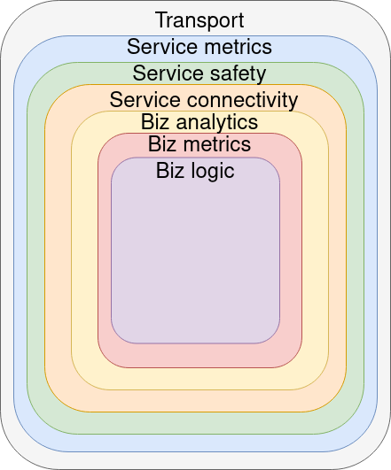

# go-kit-example
I'm learning to use the go-git microservice framework. This repository contains an example implementation of a microservice

# Overview
Go kit is structured with 7 different layers in mind. This abstraction helps
create reliable and fault tolerant microservices that are also easily 
composable and readable.
 

 
The 3 innermost layers, businee logic, business metrics and business 
analytics are the domain of the developer, which defines the actual
service functionality. The other layers are the domain of go-kit.
